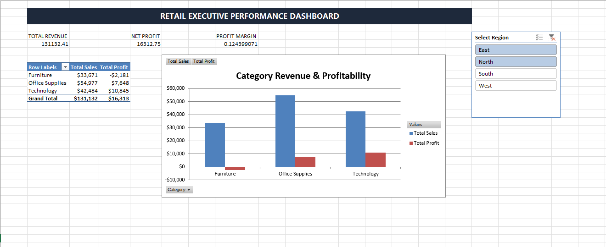

# Retail Sales Performance Analytics & Automated Excel Dashboard

An end-to-end analytics and automation project demonstrating comparative SQL/Python exploratory data analysis and a zero-click, macro-driven interactive executive dashboard in Microsoft Excel.



---

## Project Overview
This project tackles multi-dimensional retail performance optimization across 1,500 transactions, focusing on revenue drivers, regional variances, and margin leakage. 

The workflow delivers:
1. **Side-by-Side SQL vs. Python Aggregations:** Demonstrating functional syntax equivalence between relational database queries and Pandas DataFrame manipulation.
2. **Advanced SQL Window Functions:** Applying `DENSE_RANK()` and `SUM() OVER(PARTITION BY...)` to evaluate intra-category product rankings and share of wallet.
3. **One-Click Excel Dashboard Engine (VBA):** An automation macro that builds dynamic KPI cards, PivotTables, native charts, and an interactive slicer from raw tabular inputs.

---

## Core Findings
* **Severe Margin Leakage in Furniture:** Despite generating strong gross revenue, the Furniture category operates at a net negative margin (**-6.11%**), dragged down by Tables and Bookcases.
* **Technology Profit Leadership:** Technology accounts for the highest net margin contribution (>25%), driven heavily by high-volume accessory lines.
* **Regional Disparities:** The West and South regions exhibit the highest concentration of unprofitable furniture returns.

---

## Advanced SQL Window Function Execution
```sql
WITH Product_Summaries AS (
    SELECT 
        Category,
        Sub_Category,
        ROUND(SUM(Sales), 2) AS Subcat_Sales,
        ROUND(SUM(Profit), 2) AS Subcat_Profit
    FROM orders
    GROUP BY Category, Sub_Category
)
SELECT 
    Category,
    Sub_Category,
    Subcat_Sales,
    Subcat_Profit,
    DENSE_RANK() OVER(
        PARTITION BY Category 
        ORDER BY Subcat_Sales DESC
    ) AS Rank_In_Category,
    ROUND(SUM(Subcat_Sales) OVER(PARTITION BY Category), 2) AS Category_Total_Sales,
    ROUND(Subcat_Sales * 100.0 / SUM(Subcat_Sales) OVER(PARTITION BY Category), 2) AS Pct_Of_Category
FROM Product_Summaries
ORDER BY Category, Rank_In_Category;
